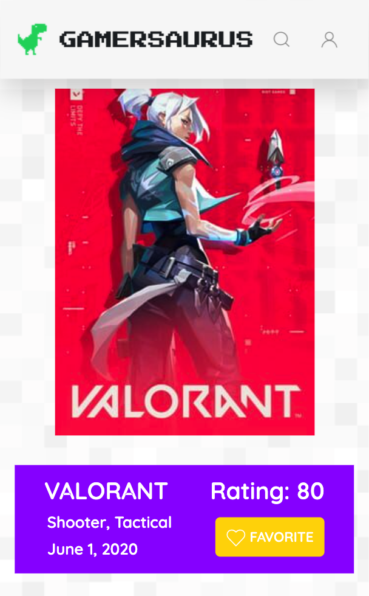
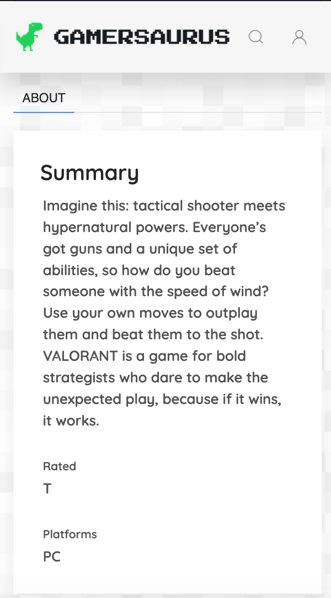
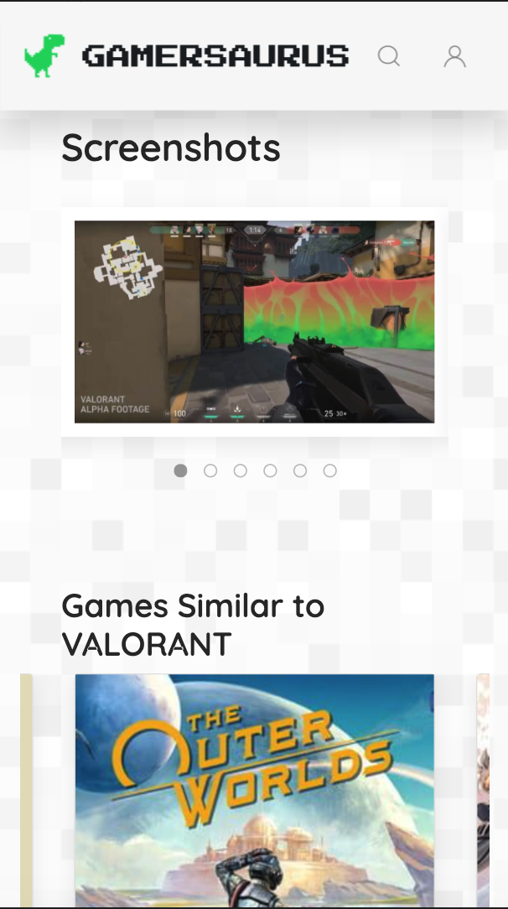
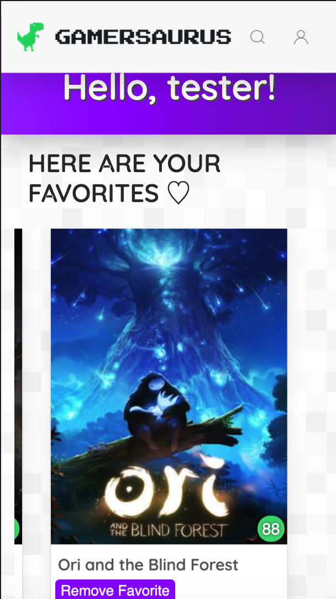

# Gamersaurus
> Discover RAWRing new games based on your favorites

> [Deployed Link](https://gamersaurus.herokuapp.com/)

## Table of contents
* [Description](#description)
* [Installation](#installation)
* [Usage](#usage)
* [Demo](#demo)
* [Questions](#questions)

## Description 
A videogame logging app that lets users favorite games and recommends similar games based on the users' library. Users can search for specific games and view the most trending games, recently released and coming soon games. Users are able to see full details about games, including the description, ratings, and related media.

## Installation
Gamersaurus was created to run in the browser with a **mobile responsive design** and therefore **no installation is needed** to run this app.

**Gamersaurus can be found at: https://gamersaurus.herokuapp.com/**

## Usage
When users first visit the site, they will be taken to the homepage where they can view the most trending games, recently released and coming soon games

Users will be redirected to details about the game that they click on, such as a description, ratings and related media

Users are also able to favorite a game when logged in to add to their collections!

Users can view their collections and choose to remove a game from their favorites

Users are able to search for games based on the titles

## Demo

## Questions
If you have any questions about the repo or would like to report a bug, open an issue or contact the team directly at:
| Contributors       | Email         | Contributors       | Email         |
| ------------- |:-------------:| ------------- |:-------------:|
|         | amarrokalboffman@gmail.com |   | mcerrillojr13@gmail.com |
|   | samuelfoster0@gmail.com |    | shuynh76@gmail.com |

